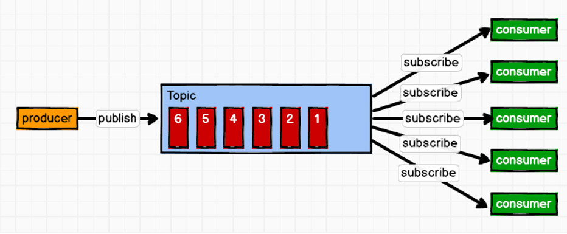
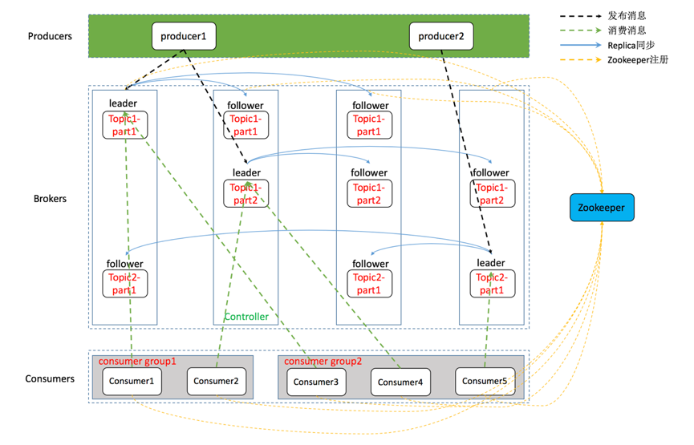
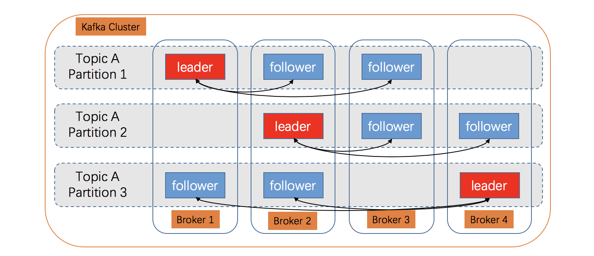
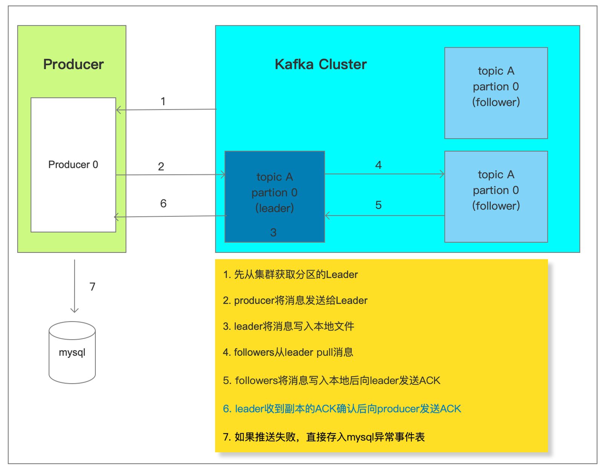
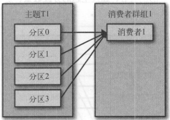
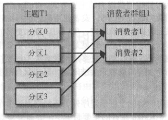
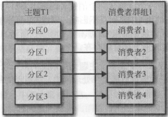
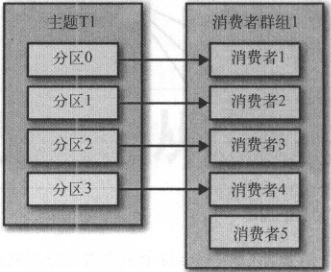
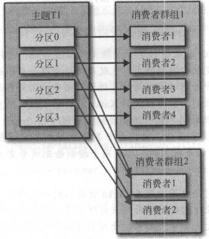

# KAFKA

## 1. Mac 安装kafka

### 1.1 安装

`brew install kafka`

### 1.2 启动

```shell
# 依赖zookeeper，需要先启动zk
## 后台启动，并设置开机重启
brew services start zookeeper
## 前台启动
zkService start

## 后台启动，并配置开机启动
brew services start kafka
## 前台启动
zookeeper-server-start /usr/local/etc/kafka/zookeeper.properties & kafka-server-start /usr/local/etc/kafka/server.properties
```

## 2. 基本操作

### 2.1 创建kafka

`./bin/kafka-topics.sh --create --zookeeper zk.service.consul:2181/common_kafka --replication-factor 1 --partitions 1 --topic logMonitor`

### 2.2 查看topic

`./bin/kafka-topics.sh --list --zookeeper zk.service.consul:2181/common_kafka`

### 2.3 删除topic

`./bin/kafka-topics.sh --delete --zookeeper zk.service.consul:2181/common_kafka --topic logMonitor`

### 2.4 消费

`./bin/kafka-console-consumer.sh --zookeeper=zk.service.consul:2181/common_kafka --topic logMonitor --from-beginning`

### 2.5 查看topic详情

`kafka-topics --describe --zookeeper=zk.service.consul:2181/common_kafka --topic mydemo5`

### 2.6 查看正在运行的消费组

`kafka-consumer-groups.sh --bootstrap-server master:9092 --list --new-consumer`

### 2.7 计算消息的消息堆积情况

`kafka-consumer-groups.sh --bootstrap-server master:9092 --describe --group  group_id`

```shell
####详细说明
#LogEndOffset：下一条将要被加入到日志的消息的位移
#CurrentOffset： 当前消费的位移
#LAG： 消息堆积量
#消息堆积量：消息中间件服务端中所留存的消息与消费掉的消息之间的差值即为消息堆积量也称之为消费滞后量
```

## 3. 概述与基本架构

### 1. 概述

Kafka是一个分布式的、基于发布订阅的消息系统，主要解决`应用解耦`、`异步消息`、`流量削峰`等问题

### 2. 发布订阅模型

消息生产者将消息发布到Topic中，同时有多个消息消费者订阅该消息，消费者消费数据之后，并不会清除消息，属于一对多的模式



### 3. 系统架构




#### 3.1 Producer

消息生产者，将消息push到Kafka集群中的Broker。

#### 3.2 Consumer

消息消费者，从Kafka集群中pull消息，消费消息。

#### 3.3 Consumer Group

+ 消费者组，由一到多个Consumer组成，每个Consumer都属于一个Consumer Group。消费者组在逻辑上是一个订阅者。
+ 消费者组内每个消费者负责消费不同分区的数据，一个分区只能由一个组内消费者消费；消费者组之间互不影响。即每条消息只能被Consumer Group中的一个Consumer消费；但是可以被多个Consumer Group组消费。这样就实现了单播和多播。

#### 3.4 Broker

一台Kafka服务器就是一个Broker,一个集群由多个Broker组成，每个Broker可以容纳多个Topic.

#### 3.5 Topic

消息的类别或者主题，逻辑上可以理解为队列。Producer只关注push消息到哪个Topic,Consumer只关注订阅了哪个Topic。

#### 3.6 Partition

负载均衡与扩展性考虑，一个Topic可以分为多个Partition,物理存储在Kafka集群中的多个Broker上。可靠性上考虑，每个Partition都会有备份Replica。

#### 3.7 Replica

Partition的副本，为了保证集群中的某个节点发生故障时，该节点上的Partition数据不会丢失，且Kafka仍能继续工作，所以Kafka提供了副本机制，一个Topic的每个Partition都有若干个副本，一个Leader和若干个Follower。

#### 3.8 Leader

Replica的主角色，Producer与Consumer只跟Leader交互。

#### 3.9 Follower

Replica的从角色，实时从Leader中同步数据，保持和Leader数据的同步。Leader发生故障时，某个Follower会变成新的Leader。

#### 3.9 Controller

Kafka集群中的其中一台服务器，用来进行Leader election以及各种Failover（故障转移）。

#### 3.9 ZooKeeper

Kafka通过Zookeeper存储集群的meta等信息。

## 4. 数据可靠性

### 4.1 多副本



+ Kafka每个Topic的partition都有N个副本（replica）。这N个副本中，其中一个replica是Leader，其他都是Follower
+ Leader负责处理Partition的所有请求，Follower负责同步Leader的数据
+ Leader故障时，通过选举产生新的Leader

### 4.2 ACK应答机制



在生产者向队列写入数据的时候可以设置参数来确定是否确认kafka接收到数据，这个参数可设置的值为0、1、all。

+ 0: 代表producer往集群发送数据不需要等到集群的返回，不确保消息发送成功。安全性最低但是效率最高。

+ 1: 代表producer往集群发送数据只要leader应答就可以发送下一条，只确保leader发送成功。

+ all: 代表producer往集群发送数据需要所有的follower都完成从leader的同步才会发送下一条，确保leader发送成功和所有的副本都完成备份。安全性最高，但是效率最低。

+ 如果往不存在的topic写数据，会自动创建topic，分区和副本的数量根据默认配置都是1。

## 5. offset管理

### 5.1 offset commit

+ 0.9之前的版本offset保存在zookeeper, 0.9之后的版本保存在本地
+ Offset的提交逻辑其实和普通的生产者往kafka发送数据是一样的，消费者启动时会为“_consumer_offset”主题创建一个内置的生产者，用于Offset数据的提交（0.9之后的版本）

### 5.2 Offset的提交方式

Offset提交时会有两个问题：重复消费和漏消费

+ 先消费，后提交Offset,如果消费成功、提交失败，消费者下次获取的Offset还是以前的，所以会造成重复消费
+ 先提交Offset，后消费,如果提交成功、消费失败，消费者下次获取的Offset已经是新的，所以会造成漏消费

根据具体的业务情况，选择合适的提交方式，可以有效的解决掉重复消费和漏消费的问题，比如通过提交指定的Offset，可以减轻重复消费和漏消费的问题，但是相应的消费端就需要复杂的业务处理，而且需要自己维护Offset。

## 6. Partition和消费者的关系

实践中，建议消费者的数量最好等于分区数量

### 6.1 一个消费者组

#### 6.1.1 消费者数量小于分区数量

只有一个消费者时，消费者1将收到4个分区的全部消息



当有两个消费者时，每个消费者将分别从两个分区接受消息



### 6.1.2 消费者数量等于分区数量

当有四个消费者时，每个消费者都可以接受一个分区的消息



### 6.1.3 消费者数量大于于分区数量

当有五个消费者时，会有闲置的消费者



### 6.2 两个消费者组

消费者群组之间是互不影响的


