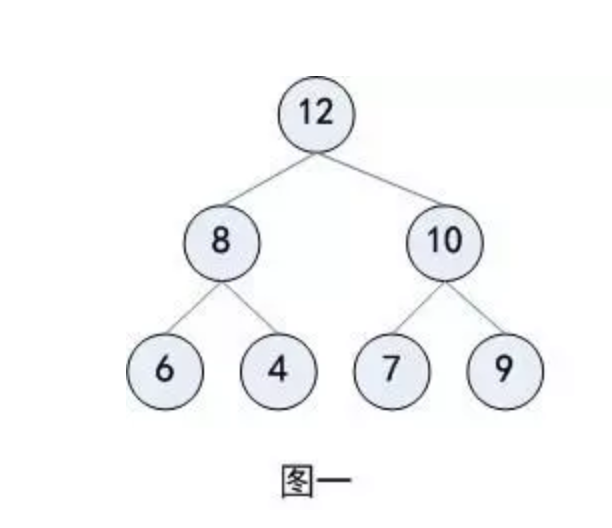
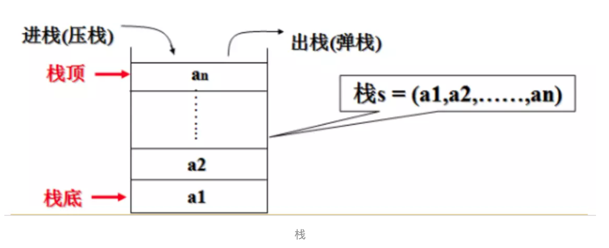
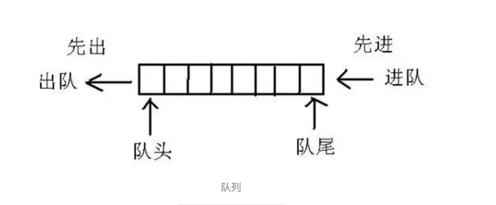

# 堆栈和队列简介

## 堆

### 1. 堆是一种经过排序的树形数据结构，每个节点都有一个值，通常我们所说的堆的数据结构是指二叉树

堆需要满足一下两个性质：

+ 堆中某个节点的值总是不大于或不小于其父节点的值
+ 堆总是一棵完全二叉树

### 2. 堆分为两种情况，有最大堆和最小堆

根节点最大的堆叫做最大堆或大根堆，根节点最小的堆叫做最小堆或小根堆。

下图图一就是一个最大堆，图二就是一个最小堆

在一个摆放好元素的最小堆中，可以看到，父结点中的元素一定比子结点的元素要小，但对于左右结点的大小则没有规定谁大谁小

## 栈

### 1. 栈是限定仅在表尾进行插入和删除操作的线性表

+ 把允许插入和删除的一端称为栈顶，另一端称为栈底，不含任何数据元素的栈称为空栈
+ 栈的特殊之处在于它限制了这个线性表的插入和删除位置，它始终只在栈顶进行
+ 栈是一种具有后进先出的数据结构，又称为后进先出的线性表，简称 LIFO（Last In First Out）结构

## 队列

### 1. 队列是只允许在一端进行插入操作、而在另一端进行删除操作的线性表

队列是一种特殊的线性表，特殊之处在于它只允许在表的前端进行删除操作，而在表的后端进行插入操作，和栈一样，队列是一种操作受限制的线性表

而且队列是一种先进先出的数据结构，又称为先进先出的线性表，简称 FIFO（First In First Out）结构

