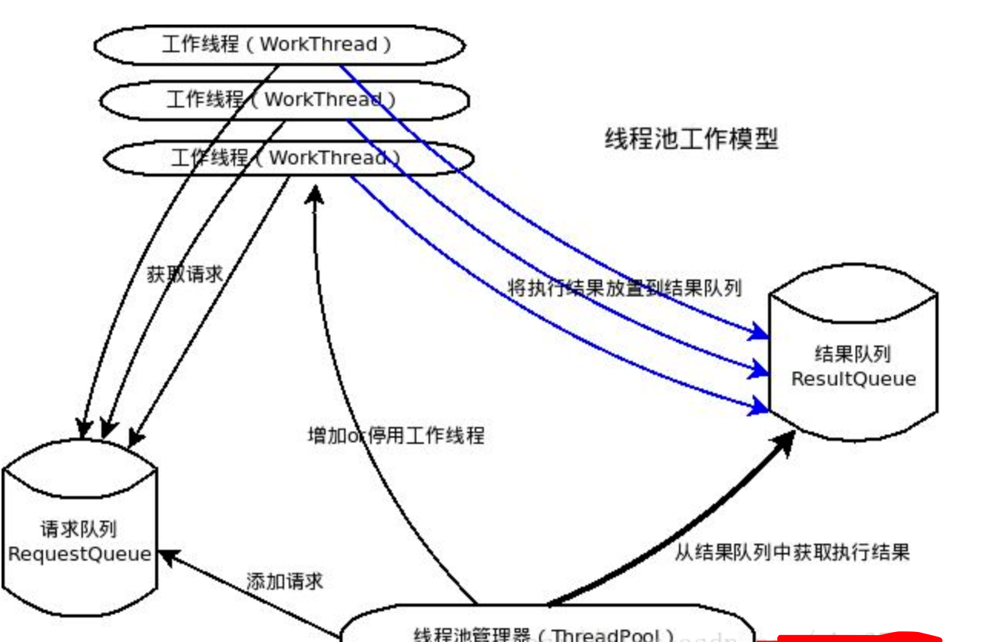

# python并发编程——线程池

在面向对象编程中，创建和销毁对象是很费时间的，因为创建一个对象要获取内存资源或者其它更多资源。

提高代码运行效率的一个手段就是尽可能减少创建和销毁对象的次数，特别是一些很耗资源的对象创建和销毁，这样就引入了“池”的概念，“池”的概念使得人们可以定制一定量的资源，然后对这些资源进行复用，而不是频繁的创建和销毁。

线程池是预先创建线程的一种技术。线程池在还没有任务到来之前，创建一定数量的线程，放入空闲队列中。这些线程都是处于睡眠状态，即均为启动，不消耗CPU，而只是占用较小的内存空间。当请求到来之后，缓冲池给这次请求分配一个空闲线程，把请求传入此线程中运行，进行处理。当预先创建的线程都处于运行状态，即预制线程不够，线程池可以自由创建一定数量的新线程，用于处理更多的请求。当系统比较闲的时候，也可以通过移除一部分一直处于停用状态的线程。

## 1. 线程的调度和启动

### 1.1 使用threading模块的Thread类的构造器创建线程

```python
import threading
from time import ctime, sleep

loops = [4, 6]
def loop(nloop, nsec):
    print('start loop', nloop, 'at:', ctime())
    sleep(nsec)
    print('loop', nloop, 'done at:', ctime())

def main():
    print('starting at:', ctime())
    threads = []
    nloops = range(len(loops))

    for i in nloops:
        t = threading.Thread(target=loop, args=(i, loops[i]))
        threads.append(t)

    for i in nloops:
        threads[i].start()

    for i in nloops:
        threads[i].join()

    print('all done at:', ctime())
if __name__ == '__main__':
    main()
```

### 1.2 继承Thread的子类，并创建子类的实例

继承threading.Thread类，并重写 run 方法

```python
import threading
from time import ctime,sleep

loops = [4, 2]


class MyThread(threading.Thread):
    def __init__(self, func, args, name=''):
        super(MyThread, self).__init__()
        self.name = name
        self.func = func
        self.args = args

    def run(self):
        self.func(*self.args)


def loop(nloop, nsec):
    print('start loop', nloop, 'at:', ctime())
    sleep(nsec)
    print('loop', nloop, 'done at:', ctime())


def main():
    print('starting at:', ctime())
    threads = []
    nloops = range(len(loops))

    for i in nloops:
        t = MyThread(loop, (i, loops[i]), loop.__name__)
        threads.append(t)

    for i in nloops:
        threads[i].start()

    for i in nloops:
        threads[i].join()

    print('all done at:', ctime())


if __name__ == '__main__':
    main()
```

## 简单线程池设计

一个典型的线程池，应该包括如下几个部分：

1. 线程池管理器（ThreadPool），用于启动、停用，管理线程池
2. 工作线程（WorkThread），线程池中的线程
3. 请求接口（WorkRequest），创建请求对象，以供工作线程调度任务的执行
4. 请求队列（RequestQueue）,用于存放和提取请求
5. 结果队列（ResultQueue）,用于存储请求执行后返回的结果



线程池管理器，通过添加请求的方法（putRequest）向请求队列（RequestQueue）添加请求，这些请求事先需要实现请求接口，即传递工作函数、参数、结果处理函数、以及异常处理函数。之后初始化一定数量的工作线程，这些线程通过轮询的方式不断查看请求队列（RequestQueue），只要有请求存在，则会提取出请求，进行执行。然后，线程池管理器调用方法（poll）查看结果队列（resultQueue）是否有值，如果有值，则取出，调用结果处理函数执行。

```python
# -*- coding: utf-8 -*-
import sys
import threading
import Queue
import traceback


class NoResultsPending(Exception):
    """All works requests have been processed"""
    pass


class NoWorkersAvailable(Exception):
    """No worket threads available to process remaining requests."""
    pass


class WorkRequest(object):
    """
        工作线程任务请求类, 封装工作线程的一些功能
        @ execute_fun: 执行函数
        @ execute_args: 执行函数的参数
        @ done_callback: 执行函数返回结果后的回调
    """

    def __init__(self, execute_fun, execute_args=None, done_callback=None):
        """
            初始化请求包装类
        """
        # 请求的标识初始化
        self.request_id = id(self)
        # 请求参数的初始化
        self.execute_fun = execute_fun
        self.execute_args = execute_args
        self.done_callback = done_callback
        self.exception = False

    def __str__(self):
        """
            请求类的相关信息
        """
        return 'WorkRequest: %s %s %s' % (self.request_id, self.execute_fun, self.exception)


class WorkerThread(threading.Thread):
    """
        工作线程
    """

    def __init__(self, requestQueue, resultQueue, time_out=5):
        """
            工作线程初始化
        """
        super(WorkerThread, self).__init__()
        self.setDaemon(True)

        # 线程初始化
        self._requestQueue = requestQueue
        self._resultQueue = resultQueue
        self.time_out = time_out
        self._stop_event = threading.Event()

        # 线程启动
        self.start()

    def run(self):
        """
            工作线程启动函数
        """
        while True:

            # 检查线程是否被停止
            if self._stop_event.is_set():
                break

            # 请求队列中取出
            try:
                request = self._requestQueue.get(True, self.time_out)
            except Queue.Empty:
                continue

            # 检查线程是否被停止
            if self._stop_event.is_set():
                self._requestQueue.put(request)
                break

            # 执行请求队列中的请求
            try:
                result = request.execute_fun(*request.execute_args)
                self._resultQueue.put((request, result))
            except:
                request.exception = True
                self._resultQueue.put((request, sys.exc_info()))

    def stop_work(self):
        """
            停止工作线程
        """
        self._stop_event.set()


class ThreadingPool(object):
    """
        线程池
    """

    def __init__(self, worker_num, request_size, time_out=5):
        """
            @ worker_num: 线程数量
            @ request_size: 请求队列的大小
            @ time_out: 队列请求超时时间
        """
        # 线程池参数初始化
        self._requestQueue = Queue.Queue(request_size)
        self._resultQueue = Queue.Queue(request_size)
        self.workers = []
        self.stoped_works = []
        self.workRequests = {}
        self.create_workers(worker_num, time_out)

    def create_workers(self, worker_num, time_out=5):
        """
            创建工作线程
        """
        for i in range(worker_num):
            worker = WorkerThread(self._requestQueue, self._resultQueue, time_out=time_out)
            self.workers.append(worker)

    def stop_workers(self, stop_num, do_join=False):
        """
            停用一定数量的线程
        """
        # 停用部分线程
        stop_list = []
        for i in range(min(stop_num, len(self.workers))):
            worker = self.workers.pop()
            worker.stop_work()
            stop_list.append(worker)

        if do_join:
            for worker in stop_list:
                worker.join()
        else:
            self.stoped_works.extend(stop_list)

    def join_all_stoped_workers(self):
        """
            join 所有停用的线程
        """
        for worker in self.stoped_works:
            worker.join()
        self.stoped_works = []

    def put_request(self, request, block=True, timeout=None):
        """
            添加请求
        """
        assert isinstance(request, WorkRequest)
        assert not getattr(request, 'exception', None)
        self._requestQueue.put(request, block, timeout)
        self.workRequests[request.request_id] = request

    def poll(self, block=False):
        """
            拉取数据进行处理, 用于wait
        """
        while True:
            if not self.workRequests:
                raise NoResultsPending
            elif block and not self.workers:
                raise NoWorkersAvailable

            # 取数据进行处理
            try:
                request, result = self._resultQueue.get(block=block)
                if request.exception:
                    print result
                elif request.done_callback:
                    request.done_callback(result)
                del self.workRequests[request.request_id]
            except Queue.Empty:
                break

    def wait(self):
        """
            等待所有请求处理完毕
        """
        while True:
            try:
                self.poll(True)
            except NoResultsPending:
                break

    def get_worker_size(self):
        """
            返回工作线程的个数
        """
        return len(self.workers)

    def stop(self):
        """
            停止线程池， 确保所有线程停止工作
        """
        self.stop_workers(self.get_worker_size(), True)
        self.join_all_stoped_workers()
```
